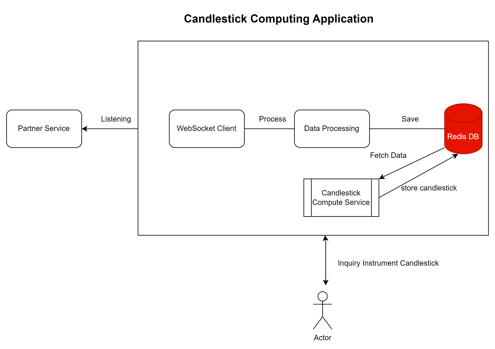

# Candlestick Computer

The Spring Boot based Application for compute and manage Candlestick based on WebSocket Partner Service.

## Table of Content

- Introduction
- System Design
- Redis Structure
- Compute Algorithm
- Tech Stack
- API Reference
- Authors
- Social Media Links
- GitHub Repository
- Future Development

## Introduction

The Candlestick System is a powerful tool designed to compute instrument data and quote prices in real-time using
WebSocket technology, implemented in Java with a Spring Boot framework and integrated with a Redis database.

At its core, the Candlestick System leverages the WebSocket protocol to establish a bidirectional communication channel
between the server and the client. This enables efficient and instantaneous transmission of instrument and quote data,
ensuring that users receive up-to-date information without any significant delays.

The system is developed using Java, a robust and widely-used programming language known for its scalability and
versatility. Java's object-oriented nature allows for the creation of modular and maintainable code, making it an ideal
choice for building complex systems like the Candlestick System.

Spring Boot, a popular Java framework, is utilized to provide a streamlined development experience. It offers a wide
range of features, such as dependency injection, autoconfiguration, and integrated testing capabilities. With Spring
Boot, developers can rapidly build and deploy WebSocket-based applications, reducing development time and effort.

To store and retrieve instrument and quote data efficiently, the Candlestick System employs Redis, an in-memory data
structure store. Redis provides high-performance data storage and retrieval capabilities, making it ideal for real-time
applications. By leveraging Redis, the system can handle large volumes of data and deliver real-time updates to clients
with minimal latency.

The Candlestick System computes candlestick charts, a popular visual representation of financial instrument price
movements over time. It analyzes incoming quote data, aggregates it into fixed time intervals (such as minutes or
hours), and generates candlestick data points. These points contain information such as the opening price, closing
price, highest price, and lowest price within the specified time interval.

The system continuously updates the candlestick charts as new quote data arrives, ensuring that users have access to the
most recent and accurate representation of price movements. Users can subscribe to specific instruments or customize
their data feeds based on their preferences. The Candlestick System allows for seamless integration with other financial
applications, enabling traders, analysts, and investors to make informed decisions based on real-time market data.

In summary, the Candlestick System is a robust and scalable solution for a computing instrument and quote prices over
WebSocket using Java, Spring Boot, and Redis. It provides real-time updates, allowing users to analyze price movements
and make informed decisions. With its efficient architecture and powerful features, the Candlestick System is a valuable
tool for anyone involved in financial markets.

## System Design



## Redis Structure

All Incoming Data including both Instrument and Quote are stored in Redis DB.

- InstrumentHash
    - Is an entity for store Instrument which has an Identifier based on ISIN
    - description stored in Instrument Hash.
- QuoteHash
    - Is an entity to store incoming Quote data and has a UUID Random Identifier
    - Indexed with Instrument ISIN
    - Store price
    - Timestamp received
    - Time chunk
- Candlestick Hash
    - Is an entity to store computed candlestick data based on instrument and stored quote data
    - UUID Random Identifier
    - ISIN
    - Time chunk
    - Open price timestamp (first incoming quote in time chunk)
    - Open price
    - High price
    - Low price
    - Close price timestamp (last incoming quote in time chunk)
    - Compute timestamp (time of computed candlestick)

## Compute Algorithm

The basic idea behind the computing algorithm is storing all instruments and quote those are listened to by websocket and
store it on Redis.
Redis is a High-Available Database Server, It's fast and scalable with cluster, so we can store incoming data as soon as
they are received.
Another Process under this algorithm is, there is a scheduled job service and its run every minute.Besides its
configurable and based on desired time chunk (in this sample time chunk is a minute).

**The Candlestick Compute Service**

Every time computing job starts, it follows these steps:

- Fetch all available instruments from database.
- For each instrument
    - Fetch a list of quotes from the previous time chunk (a minute before).
    - Calculate the open price date. It's the first element of a fetched list.
    - Calculate the open price. It's the first element of a fetched list.
    - Calculate the lowest price during this chunk time.(sorted fetched list based on quote hash price and find the
      minimum
      item).
    - Calculate the highest price during this chunk time.(sorted fetched list based on quote hash price and find the
      maximum
      item).
    - Calculate the close price date. It's the last element of a quote fetched list.
    - Calculate the close price. It's the last element of a quote fetched list.
    - Create new Candlestick Hash based on Calculated data and store in Redis.
    - If quote's list was empty, it means there isn't any new quote written in websocket, so we must calculate the current
      candlestick based on the last candlestick from redis.

## Tech Stack

- Java 17
- Spring Boot 3.1.0
- Maven
- Redis DB
- Test Container

## API Reference

#### Get Candlestick history

```http
  GET /candlesticks
```

| Parameter | Type     | Description                         |
|:----------|:---------|:------------------------------------|
| `isin`    | `string` | **Required**. Instrument Identifier |

## Authors

- [@Mostafa Anbarmoo](https://www.github.com/java-class)

## 🔗 Social Media Links

[](https://www.linkedin.com/in/mostafa-anbarmoo)

## GitHub Repository

You can find all project source code in my GitHub repository
(https://github.com/Java-class/TR-Candlestick)

## Future Development